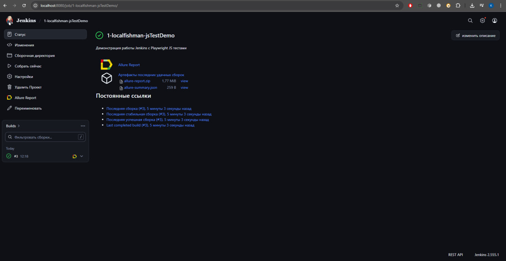
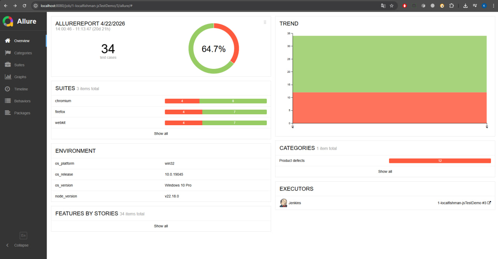

# Playwright-Page-Object-Model + Jenkins/Allure

JS+Playwright

## Jenkins



## Allure



## Установка и запуск

```bash
npm install
npx playwright install
npm test

## + Добавил сюда CI/CD - Настройку GitHub Actions
- ручной запуск автотестов
- автоматический по расписанию в полночь
- публикация allure с историей на GitHub Pages
>>>>>>> 5c8915474871111c8498b0487061a82991fda6d2
